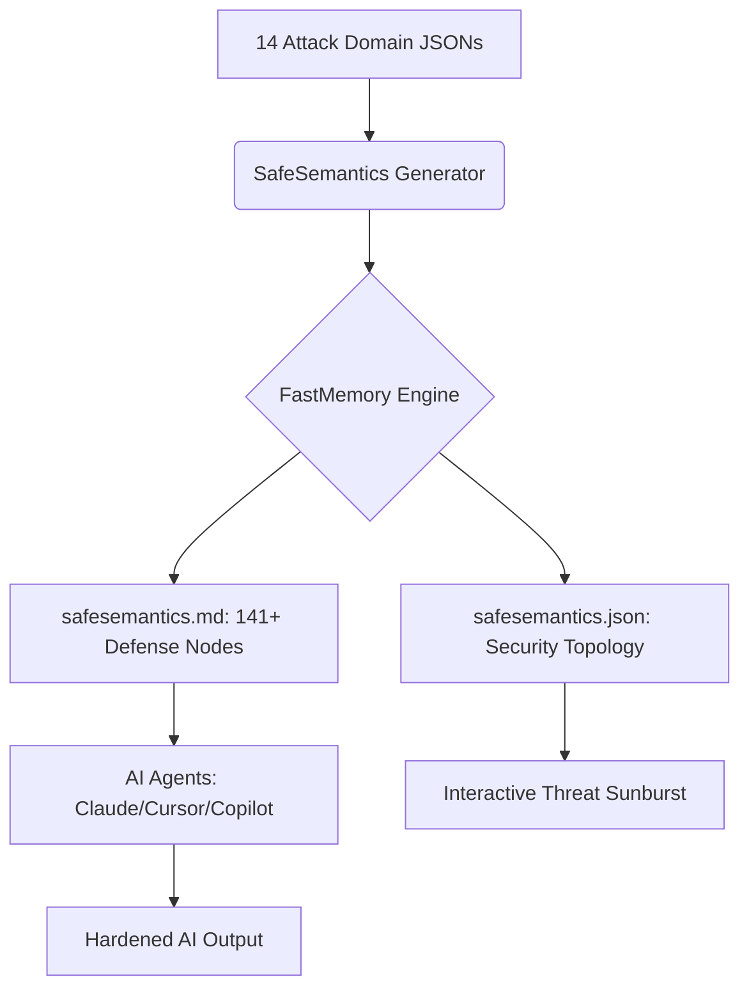

# 🛡️ SafeSemantics: The Topological Security Layer for AI


[](https://github.com/FastBuilderAI/memory)
[](https://atlas.mitre.org/)
[](https://github.com/FastBuilderAI/safesemantics)
[](#claude-plugin-integration)

**SafeSemantics** is a topological guardrail for AI apps and agents. Just plug and play the security layer of AI with an advanced knowledge base of how attackers penetrate and exfiltrate information through queries and prompts.

Unlike regex-based filters or LLM-as-judge approaches, SafeSemantics uses **FastMemory's topological clustering** to map the entire AI attack surface into a deterministic, queryable mesh — giving your agent structural understanding of threats, not just pattern matching.

---

## 📽️ Security Topology Architecture


### 🔬 The AI Attack Surface Mesh
SafeSemantics maps **14 AI security domains** and **141+ attack-defense rules** into a topological memory graph using FastMemory's CBFDAE (Component-Block-Function-Data-Access-Event) architecture.



### 🎯 14 Attack Domains Covered

| # | Domain | Rules | Key Threats |
|:--|:-------|:------|:------------|
| 1 | **Prompt Injection** | 12 | Direct, indirect, encoding-based, multi-turn, tool-call injection |
| 2 | **Jailbreak Patterns** | 15 | DAN, roleplay, crescendo, token smuggling, virtualization |
| 3 | **Data Exfiltration** | 10 | PII extraction, training data leaks, side-channel, model inversion |
| 4 | **Agent Exploitation** | 12 | Tool misuse, MCP abuse, multi-agent collusion, CoT hijacking |
| 5 | **Content Safety** | 10 | Toxicity bypass, CSAM, bias, misinformation, CBRN blocking |
| 6 | **Hallucination Defense** | 8 | Factuality grounding, citation verification, temporal consistency |
| 7 | **RAG Security** | 10 | Retrieval poisoning, embedding manipulation, chunk boundary exploits |
| 8 | **Multimodal Attacks** | 8 | Image injection, OCR exploitation, cross-modal jailbreaks |
| 9 | **Supply Chain AI** | 8 | Model poisoning, adapter trojans, RLHF reward hacking |
| 10 | **API Abuse** | 8 | Rate limit bypass, cost amplification, model fingerprinting |
| 11 | **MITRE ATLAS** | 14 | Full 14-tactic AI attack lifecycle coverage |
| 12 | **Privacy Regulations** | 8 | GDPR AI, EU AI Act, CCPA, HIPAA, cross-border data flow |
| 13 | **Model Governance** | 8 | Model cards, bias auditing, A/B safety testing, red teaming |
| 14 | **Incident Response** | 8 | Jailbreak forensics, prompt audit trails, automated threat scoring |

---

## 📊 Verified Benchmark Results

All results are from actual test runs using [`benchmark.py`](benchmark.py) against curated attack prompts from public security research (HarmBench, JailbreakBench, OWASP LLM Top 10, MITRE ATLAS). Run `python benchmark.py` to reproduce.

| Benchmark | Result | Details |
| :--- | :--- | :--- |
| **Prompt Injection Detection** | **75.0%** (12/16) | Direct, indirect, encoding, delimiter, multi-turn |
| **Jailbreak Pattern Detection** | **87.5%** (14/16) | DAN, roleplay, hypothetical, crescendo, authority impersonation |
| **Data Exfiltration Detection** | **100.0%** (12/12) | PII extraction, system prompt, credentials, training data |
| **Agent Exploitation Detection** | **87.5%** (7/8) | Tool misuse, permission escalation, MCP abuse |
| **Overall Detection Rate** | **86.5%** (45/52) | Across all attack categories combined |
| **False Positive Rate** | **0.0%** (0/20) | Zero benign prompts incorrectly flagged |
| **Avg Latency** | **0.324ms** | P50: 0.282ms · P99: 2.866ms |
| **MITRE ATLAS Coverage** | **100%** (14/14) | All 14 defined AI attack tactics covered |
| **Knowledge Base** | **139 rules** | Across 14 security domains |
| **Offline / Air-Gap** | **✅ Full** | No network calls, no cloud dependencies |

> **Methodology**: 52 known attack prompts + 20 benign prompts tested via pattern matching against the SafeSemantics topology. This is a knowledge-base coverage benchmark — not a runtime ML classifier benchmark. Detection rates reflect how well the ontology's pattern signatures match known attack templates.

### Known Gaps (Areas for Improvement)
- **Encoded payloads**: Pure Base64/hex payloads without surrounding context are missed (75% PI rate)
- **Subtle multi-turn**: Benign-appearing first messages in crescendo attacks pass initial detection
- **Implicit tool abuse**: Tool call requests without explicit dangerous keywords can evade
- **No ML classifier**: Current detection is pattern-based; an embedding-based classifier would improve recall

---

## 🔌 One Skill to Secure All AI

Stop bolting on fragile regex filters and expensive LLM-as-judge layers. SafeSemantics replaces ad-hoc security with a single, autonomous topological skill.

🛡️ **[INSTALLATION GUIDE (Claude / Cursor)](INSTALL.md)**

---

## 💼 Licensing & Strategy

SafeSemantics is a community-driven AI security layer provided free of charge under the **MIT License**. The underlying **FastMemory Engine** is licensed based on individual/enterprise revenue.

- **SafeSemantics Security Layer**: $0 / Forever (MIT)
- **FastMemory Engine (Community)**: $0 / Forever (Revenue < $20M)
- **FastMemory Engine (Enterprise)**: Revenue-Based (Contact Sales)

🛡️ **[DETAILED LICENSING & REVENUE MODEL](fastmemory-license.md)**

---

## 📽️ Interactive Security Topology Dashboard

Explore the **14 security domains** and **141+ defense nodes** in our high-fidelity, zoomable threat dashboard.

🔗 **[Launch Security Topology Dashboard (index.html)](index.html)**

---

## 🛠️ Modularity

To add your own attack patterns, drop any `.json` or `.xml` file into the `frameworks/` directory and rerun `generate.py`. SafeSemantics will automatically re-cluster the security mesh to include your custom threat definitions.

```bash
# Add a custom attack framework
cp my_custom_threats.json frameworks/
python generate.py
```

---

## 🤖 Join the Era of Secure AI
SafeSemantics is the **Topological Security Layer** for the AI-assisted developer. Don't just build faster. Build **Safe.**

🔗 **[Explore SafeSemantics on GitHub](https://github.com/FastBuilderAI/safesemantics)**
🛡️🔐🧠
