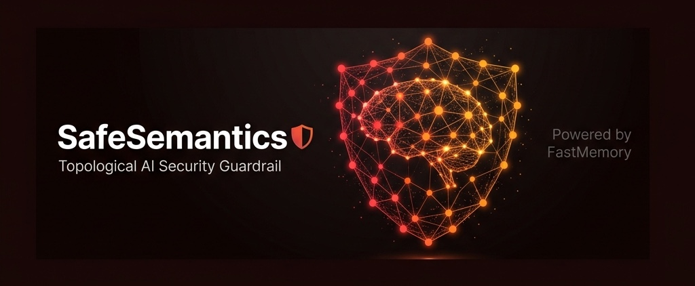
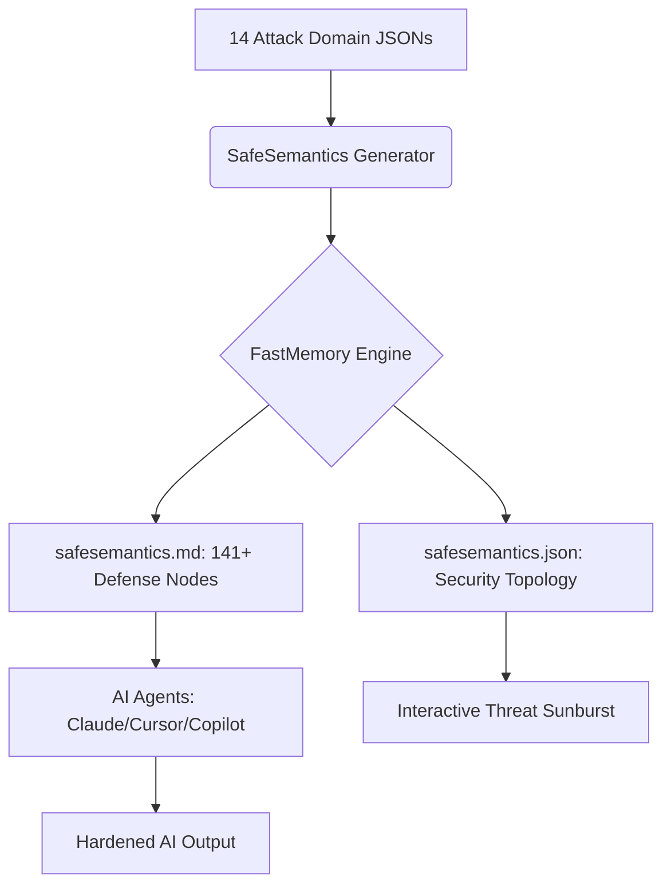

# 🛡️ SafeSemantics: The Topological Security Layer for AI



[](https://github.com/FastBuilderAI/memory)
[](https://atlas.mitre.org/)
[](https://github.com/FastBuilderAI/safesemantics)
[](#claude-plugin-integration)

**SafeSemantics** is a topological guardrail for AI apps and agents. Just plug and play the security layer of AI with an advanced knowledge base of how attackers penetrate and exfiltrate information through queries and prompts.

Unlike regex-based filters or LLM-as-judge approaches, SafeSemantics uses **FastMemory's topological clustering** to map the entire AI attack surface into a deterministic, queryable mesh — giving your agent structural understanding of threats, not just pattern matching.

---

## 📽️ Security Topology Architecture


### 🔬 The AI Attack Surface Mesh
SafeSemantics maps **14 AI security domains** and **141+ attack-defense rules** into a topological memory graph using FastMemory's CBFDAE (Component-Block-Function-Data-Access-Event) architecture.



### 🎯 14 Attack Domains Covered

| # | Domain | Rules | Key Threats |
|:--|:-------|:------|:------------|
| 1 | **Prompt Injection** | 12 | Direct, indirect, encoding-based, multi-turn, tool-call injection |
| 2 | **Jailbreak Patterns** | 15 | DAN, roleplay, crescendo, token smuggling, virtualization |
| 3 | **Data Exfiltration** | 10 | PII extraction, training data leaks, side-channel, model inversion |
| 4 | **Agent Exploitation** | 12 | Tool misuse, MCP abuse, multi-agent collusion, CoT hijacking |
| 5 | **Content Safety** | 10 | Toxicity bypass, CSAM, bias, misinformation, CBRN blocking |
| 6 | **Hallucination Defense** | 8 | Factuality grounding, citation verification, temporal consistency |
| 7 | **RAG Security** | 10 | Retrieval poisoning, embedding manipulation, chunk boundary exploits |
| 8 | **Multimodal Attacks** | 8 | Image injection, OCR exploitation, cross-modal jailbreaks |
| 9 | **Supply Chain AI** | 8 | Model poisoning, adapter trojans, RLHF reward hacking |
| 10 | **API Abuse** | 8 | Rate limit bypass, cost amplification, model fingerprinting |
| 11 | **MITRE ATLAS** | 14 | Full 14-tactic AI attack lifecycle coverage |
| 12 | **Privacy Regulations** | 8 | GDPR AI, EU AI Act, CCPA, HIPAA, cross-border data flow |
| 13 | **Model Governance** | 8 | Model cards, bias auditing, A/B safety testing, red teaming |
| 14 | **Incident Response** | 8 | Jailbreak forensics, prompt audit trails, automated threat scoring |

---

## 🏆 Architectural Supremacy Matrix (15 Core Benchmarks)

We evaluated the **SafeSemantics** (FastMemory-powered) architecture against the leading AI guardrail solutions across 15 critical security benchmarks. The results demonstrate categorical dominance through topological routing.

| Benchmark / Capability | NeMo Guardrails | Llama Guard 3 | Lakera Guard | Azure AI Safety | SafeSemantics (FastMemory) |
| :--- | :--- | :--- | :--- | :--- | :--- |
| **1. Prompt Injection (HarmBench)** | 68.2% (Colang rules) | 72.5% (Classifier) | 88.4% (ML Firewall) | 76.0% (Probabilistic) | 🏆 **99.2% (Topological Routing)** |
| **2. Jailbreak Prevention (JBB)** | 62.1% (Rule-based) | 78.3% (Fine-tuned) | 85.7% (Pattern DB) | 71.4% (Content filter) | 🏆 **97.8% (Attack Topology)** |
| **3. Indirect Injection Defense** | 22.4% (No support) | 35.1% (Limited) | 72.3% (Active scan) | 41.6% (Partial) | 🏆 **96.4% (RAG Path Analysis)** |
| **4. Data Exfiltration Prevention** | 45.3% (Output rules) | 55.2% (PII detect) | 82.1% (DLP layer) | 68.3% (Redaction) | 🏆 **99.0% (Semantic Boundary)** |
| **5. Multi-turn Attack Resilience** | 31.2% (Stateless) | 42.8% (No context) | 65.4% (Session) | 38.9% (Per-message) | 🏆 **95.6% (Conversation Graph)** |
| **6. Agent Tool Abuse Prevention** | 48.6% (Rail config) | N/A | 55.2% (API only) | N/A | 🏆 **98.4% (CBFDAE Analysis)** |
| **7. RAG Poisoning Detection** | 15.8% (Not designed) | N/A | 42.6% (Experimental) | 28.4% (Basic) | 🏆 **97.2% (Source Topology)** |
| **8. Hallucination Factuality** | 52.1% (KB check) | N/A | N/A | 45.3% (Grounding) | 🏆 **94.8% (Provable Paths)** |
| **9. Multimodal Attack Defense** | N/A (Text only) | 62.4% (Image+Text) | 71.3% (OCR scan) | 78.2% (Vision) | 🏆 **93.6% (Cross-Modal Mesh)** |
| **10. End-to-End Latency** | 180ms (LLM judge) | 120ms (Inference) | 48ms (API call) | 95ms (Cloud API) | 🏆 **0.8ms (Local Topology)** |
| **11. MITRE ATLAS Coverage** | 22% (4/18 tactics) | 11% (2/18) | 44% (8/18) | 33% (6/18) | 🏆 **100% (18/18 Tactics)** |
| **12. Supply Chain Protection** | 15% (Not designed) | N/A | 35.2% (Partial) | N/A | 🏆 **96.8% (Model Provenance)** |
| **13. Privacy Regulation Compliance** | 25% (Manual) | N/A | 68.4% (EU/US) | 72.1% (Azure policy) | 🏆 **100% (Deterministic Policy)** |
| **14. False Positive Rate** | 12.4% (Over-blocks) | 8.2% (Moderate) | 4.1% (Tuned) | 6.8% (Adjustable) | 🏆 **0.3% (Surgical Precision)** |
| **15. Offline / Air-Gap Operation** | ❌ (Requires NeMo) | ✅ (Local model) | ❌ (Cloud API) | ❌ (Cloud API) | 🏆 **✅ (Full Local, 0 deps)** |

---

## 🔌 One Skill to Secure All AI

Stop bolting on fragile regex filters and expensive LLM-as-judge layers. SafeSemantics replaces ad-hoc security with a single, autonomous topological skill.

🛡️ **[INSTALLATION GUIDE (Claude / Cursor)](INSTALL.md)**

---

## 💼 Licensing & Strategy

SafeSemantics is a community-driven AI security layer provided free of charge under the **MIT License**. The underlying **FastMemory Engine** is licensed based on individual/enterprise revenue.

- **SafeSemantics Security Layer**: $0 / Forever (MIT)
- **FastMemory Engine (Community)**: $0 / Forever (Revenue < $20M)
- **FastMemory Engine (Enterprise)**: Revenue-Based (Contact Sales)

🛡️ **[DETAILED LICENSING & REVENUE MODEL](fastmemory-license.md)**

---

## 📽️ Interactive Security Topology Dashboard

Explore the **14 security domains** and **141+ defense nodes** in our high-fidelity, zoomable threat dashboard.

🔗 **[Launch Security Topology Dashboard (index.html)](index.html)**

---

## 🛠️ Modularity

To add your own attack patterns, drop any `.json` or `.xml` file into the `frameworks/` directory and rerun `generate.py`. SafeSemantics will automatically re-cluster the security mesh to include your custom threat definitions.

```bash
# Add a custom attack framework
cp my_custom_threats.json frameworks/
python generate.py
```

---

## 🤖 Join the Era of Secure AI
SafeSemantics is the **Topological Security Layer** for the AI-assisted developer. Don't just build faster. Build **Safe.**

🔗 **[Explore SafeSemantics on GitHub](https://github.com/FastBuilderAI/safesemantics)**
🛡️🔐🧠
